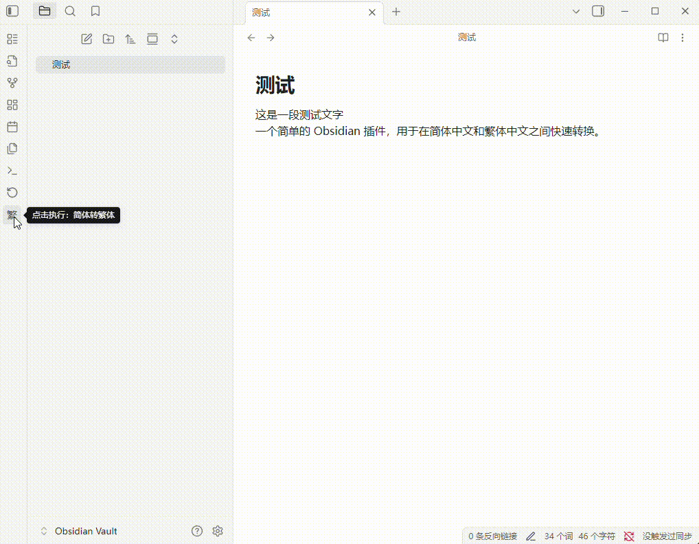

# Obsidian 中文简繁转换 (Chinese Converter)

一个简单的 Obsidian 插件，用于在简体中文和繁体中文之间快速转换。

## 功能

-   通过左侧 Ribbon 栏的图标按钮进行简繁转换。该按钮会自动切换状态。
    -   图标显示 **“繁”** 时，点击执行“简体 -> 繁体”。
    -   图标显示 **“简”** 时，点击执行“繁体 -> 简体”。
-   支持命令面板调用：
    -   `Convert Simplified to Traditional (简体转繁体)`
    -   `Convert Traditional to Simplified (繁体转简体)`
-   支持对选中文本或整个文档进行转换。

## 如何使用

1.  点击左侧 Ribbon 栏的 **“繁”** / **“简”** 图标。
2.  或打开命令面板 (Cmd/Ctrl + P)，输入“繁体”或“简体”来查找转换命令。

### 演示

## 安装

### 从社区插件市场安装

1.  在 Obsidian 中打开 `设置` > `第三方插件`。
2.  确保安全模式为 **关闭**。
3.  点击 `社区插件` > `浏览`。
4.  搜索 "Chinese Converter"。
5.  点击 `安装`。
6.  安装完成后，在“已安装插件”列表中启用本插件。

## 作者

[LanternYoru](https://github.com/LanternYoru)
